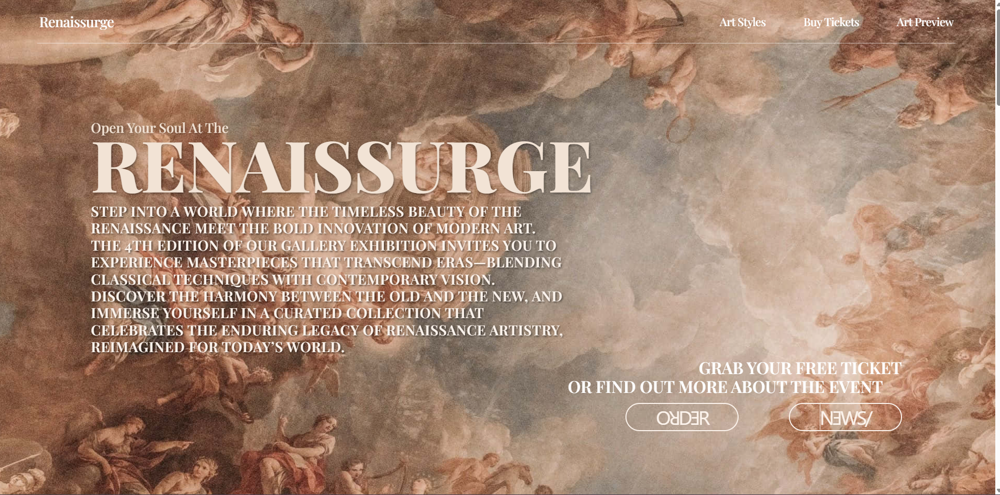
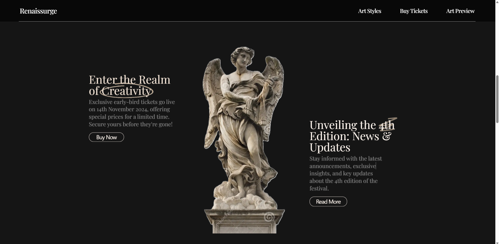
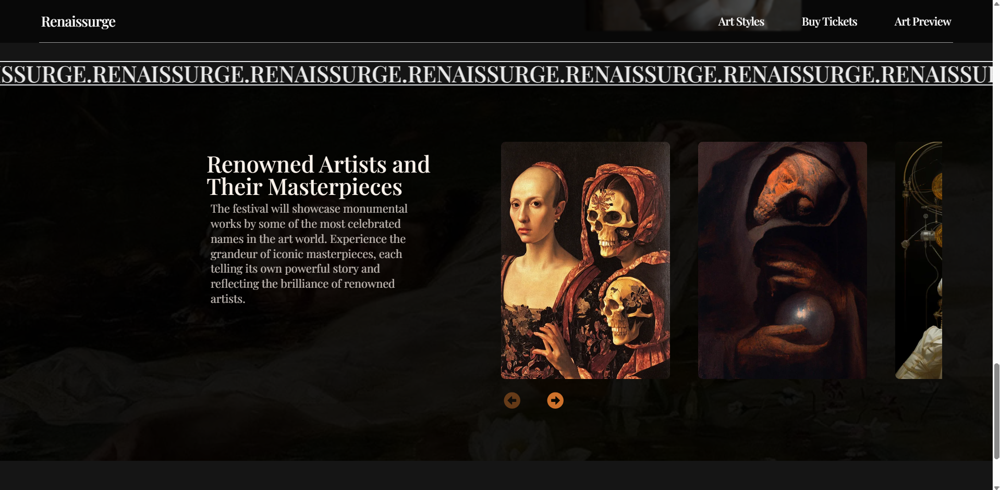

# Art Gallery Festival

---

---

---
A simple webpage serving as an invitation to an art festival featuring diverse art galleries and live music. This mini-project primarily focuses on the visual aspect, experimenting with various UI elements, blending multiple artistic styles, and incorporating smooth animations and Parallax effects for an engaging and captivating experience.

## 🏵️ Live Demo

[Check out the live demo here](https://kubanec01.github.io/Art_Gallery_Festival/)

## 🎨 Technologies Used

- React + Vite
- TypeScript
- Tailwind CSS

## 🔧 Installation

To run the project locally, follow these steps:

1. Clone the repository:

   - `git clone https://github.com/Kubanec01/Art_Gallery_Festival`

2. Navigate to the project directory:

   - `cd Art_Gallery_Festival`

3. Install the dependencies:

   - `npm install`

4. Run the app locally:
   - `npm run dev`

Once the app is running, open your browser and go to `http://localhost:3000` to view the app in action.
